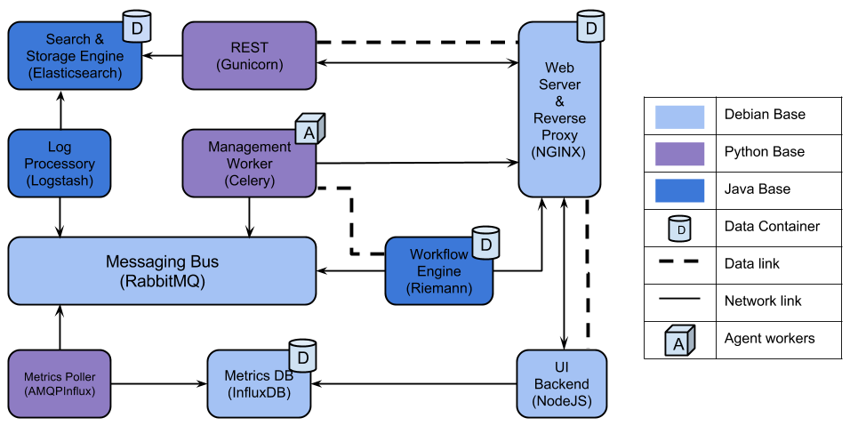

Cloudify-Packager
=================

Cloudify's configuration objects we use to build Cloudify's Management environments, agents and demo images.

### Current Architecture




### [Docker](http://www.docker.com) Images

Please see [Bootstrapping using Docker](http://getcloudify.org/guide/3.2/installation-bootstrapping.html#bootstrapping-using-docker) for information on our transition from packages to container-based installations.

#### Building Cloudify's Docker Images

We use [docker-compose](https://docs.docker.com/compose/) to generate our images.
Configuration for all images can be found under the `docker` directory in a corresponding sub-directory.
`docker-compose.yml` contains the configuration for the build.

`build.sh` is for internal purposes. Please ignore.

To build, execute the following:

```shell
sudo docker-compose -p cloudify build javabase pythonbase
sudo docker-compose -p cloudify build
```

Port exposure, commands, volumes and environment variables are contained within the Dockerfiles.
In addition, each image receives a [SERVICE]-NOTICE.txt file with the relevant licensing information.

#### Running the containers locally

A `run` file is provided which allows anyone to run all containers on a local machine.
The `run` file contains everything that's necessary to run Cloudify's Management Environment.


### [packman](http://packman.readthedocs.org) configuration

Packman is used to generate Cloudify's Agent Packages.
This repository contains packman's configuration for creating the packages.

#### package-configuration

The package-configuration folder contains the init scripts and configuration files for Cloudify's packages.

#### package-templates

The package-templates folder contains the bootstrap scripts that are used to install Cloudify's packages.

#### packages.py

The packages.py file is the base packman configuration file containing the configuration of the entire stack (including agents).


### [Vagrant](http://www.vagrantup.com)

Cloudify's packages are created using vagrant VM's (currently on AWS).

The Vagrant folder contains vagrant configuration for different components that are generated using packman:

- A Vagrant VM is initialized.
- Packman is installed on the machine alongside its requirements.
- If a virtualenv is required, it is created and the relevant modules are installed in it.
- Packman is used to create the environment into which the components are retrieved.
- Packman is used to create the package.

NOTE: the Windows Agent Vagrantfile uses a premade image already containing the basic requirements for creating the Windows agent.

#### image-builder

Creates a Vagrant box with a Cloudify Manager preinstalled for Virtualbox, AWS and HPCloud. This provides our Quickstart.